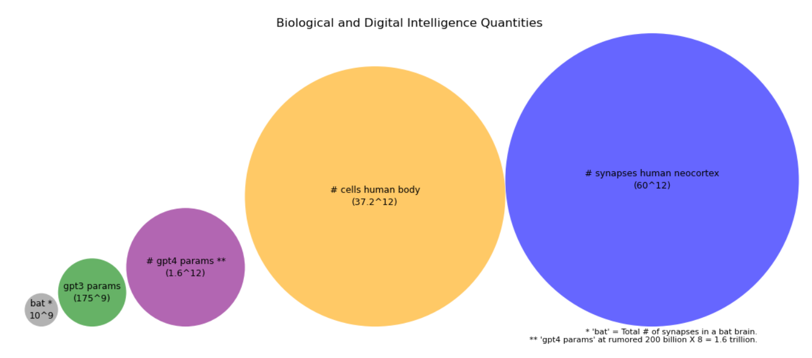

# Visualizations of Orders of Magnitude

This project provides a set of visualizations illustrating the orders of magnitude across different domains, for example: biological and digital compute quantities. It leverages Python's Pyplot.

## Installation

Clone this repository using git:

```bash
git clone https://github.com/NomanTrips/orders_of_magnitude.git
```

Ensure you have Python installed on your system. The project is built and tested with Python 3.x.

## Usage

To generate the visualizations, run the script `bio_digital_intelligence_quantities.py` from the command line:

```bash
python bio_digital_intelligence_quantities.py
```

## Example Visualization



This example showcases the comparison between the number of synapses in a human neocortex and the number of parameters in various AI models.

## Contributing

Contributions to the project are welcome. You can contribute by improving the visualizations, extending the dataset, or suggesting new features.

## License

This project is licensed under the [MIT License](LICENSE.md).
